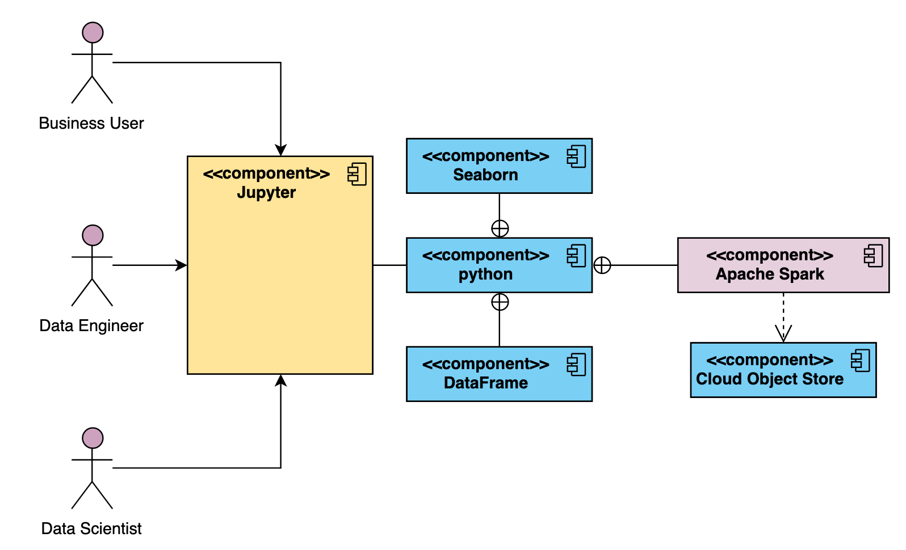
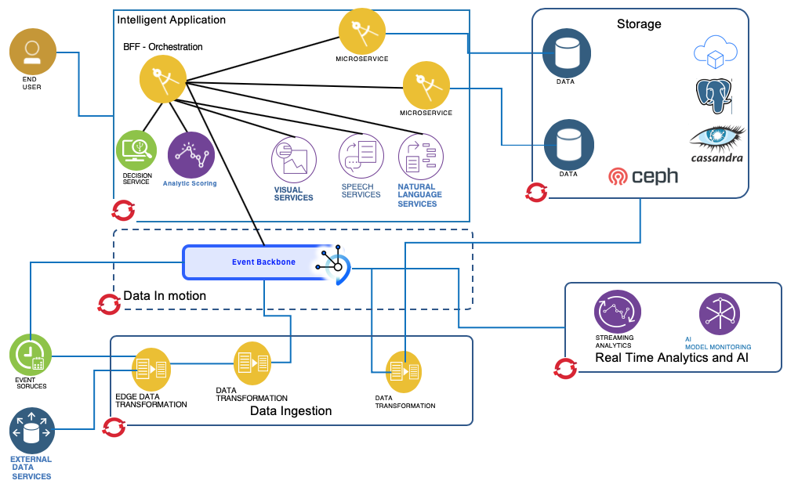

# Data and AI Architecture Principles

## Context

As we look to the Data and AI reference architecture it becomes essential that we have deep understanding of the range of uses, how value is realized from data, the dependencies between data AI and applications, and the constraints which we may face in multi-cloud environments with compute power, data storage and network connectivity/latency.

Through consideration of these aspects we have pulled out the following *Guiding Principles* which help to guide both the architecture patterns and our thinking or methodology for how to approach developing **Intelligent applications**:

1. There exists a spectrum of concerns ranging from single source of truth to data hyper personalisation.  
1. Different roles require specialised data stores with redundancy and replication between them
1. Different application patterns apply different data specialisations.
1. There is a dependency between AI and Data Management.
1. With an **Intelligent Application** there are
    
    * a Data concern,
    * an AI model management concern,
    * a Multi cloud deployment concern.

1. As you constrain scalability and network connectivity you also constrain data storage, data structure and data access.    
1. The value and way of storing and representing data may change with its age.
1. Value also comes in the recognition of patterns in a time series.

Looking ahead with the modern digital business we will increasingly see our users have access to terabytes, petabytes, or even exabytes of data. If this data is not *collected, organized, managed, controlled, enriched, governed, measured, and analyzed*, the data is not just useless, it becomes a liability.

Embracing this challenge by putting in the right systems, built on a well defined data an AI architecture and following proven methodologies for developing new [Intelligent Applications](intelligent-app.md) will become an essential step for all enterprises.

## Architectural Principles

|Name | Simplicity First 
--- | --- 
Statement | If a functionality or Technology Component is not needed in the current iteration, it shouldn't be part of the architecture. There must be a need for it in the current iteration.  
Rationale | Distraction is on of our worst enemies. Humans tend to get lost in the abundance of possibilities. By sticking to the Architectural Principle, clear focus on project delivery is ensured.
Implications| The majority of projects are over-engineered. This adds direct cost for additional unnecessary work and indirect maintenance cost due to architectural complexity. By enforcing the most simple architecture practitioners can focus on solving problems without getting distracted.

|Name | OpenSource First 
--- | --- 
Statement | If a functionality or Technology Component is available as Open Source, this should be given preference.
Rationale | Open Source software tends to be more stable, better documented and better understood which pushed TCO down 
Implications| When using Open Source vendor lock-in is reduced, experts are more abundant and standards are followed more tightly. In addition, independence from a vendor allows for development of extensions to address business needs which might not be available in timely manner from the vendor

|Name | Homogeneity First
--- | --- 
Statement | If a Technology Component is available from the same product suite it should be given preference.
Rationale | Although standards exist and a lot of products are compatible with each other, compatibility never reaches the level of products coming from the same product suite.  
Implications| If one relies on standards assuming compatibility between Technology Components during Architectural Development and those are broken whole Solution Architectures or Technology Architectures can become completely or partially invalid. Improving homogeneity mitigates that risk.

|Name | Never touch a running system
--- | --- 
Statement | If a Technical Component is needed, it should be provisioned from scratch without reusing existing systems.   
Rationale | When creating "Systems of Innovation" speed is on of the key drivers. Therefore, every interaction with existing system introduces complexity, delay and risk.
Implications| Especially in public, hybrid and private Cloud environments it is more effective to provision a Technical Component as a Service over adjusting an existing Technical Component. 

|Name | Data Locality First
--- | --- 
Statement | Allocate compute and storage always as close as possible
Rationale | Data movement is more expensive than data storage. Bottlenecks slow systems down.
Implications| Data movement, especially  between cloud providers or data centers are usually more expensive than allocating a compute note close to the data. Therefore, cost can be kept low and performance can be kept high 

## Defining the architecture incrementally

The IBM Garage methodology guides the development team to adopt an incremental and iterative development practices, lean method. As part of the lean adoption, the implementation of an intelligent application integrates different concerns: microservice, data and AI model developments. But architecture is not forgotten, and it should be done also incrementally. Even if the target end to end solution will look similar to the reference architecture as illustrated in the diagram below, not all components need to be in place at the beginning of a Minimum Viable Product.

    Figure 1: The Data and AI Reference Architecture

The goal of the architects will be, to select product for each of the needed capabilities following the guidances presented in the [architectural principles](#architectural-principles) above and build the architecture per increment and reuse previously define capabilities.

Because it can be hard to initially define the architecture of a project, our method starts with the reference architecture and supports architectural changes while following the development of the process model.

    Figure 2: Process Model and Architectural Development Method

This way application development and architectural development work hand in hand to produce a production ready and deployable product at the end of each iteration. 

### Data science lightweight architecture

As an example, a Data Scientist's environment architecture, in the context of getting started, or for a MVP, will include the minimum components, as illustrated below:

    Figure 3: The Lightweight Reference Architecture

but can evolve over time to address most of the components as described [in the model building reference architecture.](./build-model.md)  

### Microservice integration lightweight architecture

For the intelligent application the first architecture may include microservice, serving Web channel, using the Backend for frontend pattern, and doing integration with other microservices. Each service has its own repository that can use different technologies like RDBMS, noSQL, filesystem, cache... A service can be consumer and publisher of events, and can integrate with pre-built AI model.

    Figure 4: Microservice MVP architecture

The scoring service can be deployed as a service or integrated in an agent as part of a real time streaming analytics. The extended runtime architecture is presented in [this article](runtime-flow.md).

### Data lightweight architecture

The same apply for the data architecture: the previous diagram illustrates the need to have data ingestion components responsible to extract, transform and load data from data source to storage area. In distributed system the storage need to support high availability and distribution intra and inter datacenters. When scaling the data adoption, architects need to work on the [data topology](../topology/README.md), and extend to the reference architecture as presented in [this article](collect-org-data.md).

