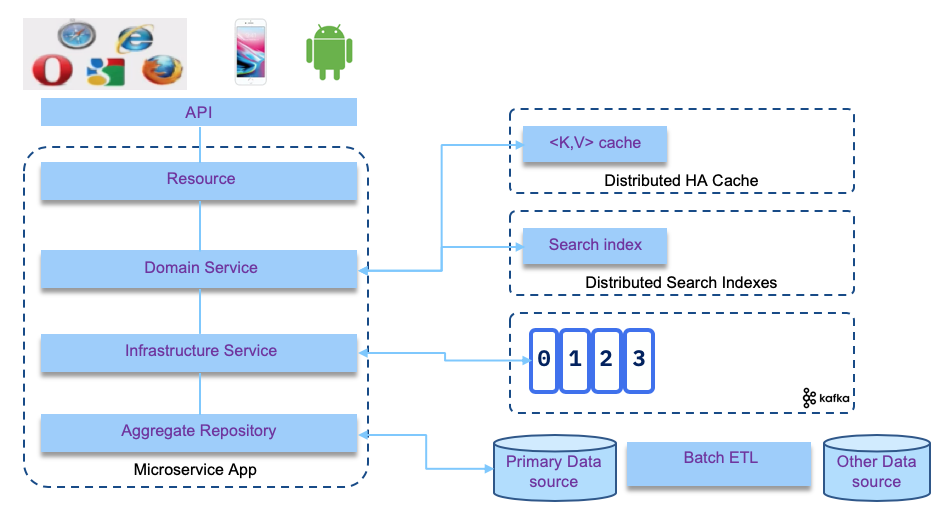

# Designing Data intensive applications

In this article we are highlighting some practice to design data intensive application and microservice solution. This is strongly linked to the adoption of event-driven microservices, but address the data consistency and eventual data consitency discussions, as well as the different strategies for implementation.

Started 10/30/2019, still under heavy work.

## Context

A typical modern business solution will include a set of microservices working together in choreography to exchange data. The adoption of event-driven microservice with all related design pattern is described in separate articles that you can read [here](https://ibm-cloud-architecture.github.io/refarch-eda/design-patterns/ED-patterns/). 

When zooming to a particular data intensive microservice we will find a set of important data centric features that may look like in the diagram below, which presents one instance of a distributed system.

The components involved include:

* Databases to store data for long term
* Caches to speed up retrieving data from expensive operation
* Search indexes to support search on a corpus
* Stream processing to pub/sub messages with other processes, which are now also considered as long duration datastores (Kafka).
* Batch processing to move large data between data sources

When designing such application we need to address a set of important subjects:

* How to ensure data correctness and completeness?
* How to address good performance when exposing data, even when app is running slowly?
* How to scale and address increase in transaction volume and data size increase?
* What data to expose to other services via messaging ?
* What data to expose to other services via APIs ?
* How to support application reliability when some components are not performing within their SLA? How to be fault-tolerant?
* How to test fault-tolerance?
* How adding horizontal compute power impact the data access?

In modern big data applications, hardware redundancy is not suffisant, the design needs to support unexpected faults, to avoid cascading failures and to support new version deployment with rolling-upgrade capability. 

When addressing scalability and load growth, we need to define the load parameters: number of transactions per second, or number of read and write operations, number of active sessions, ... on average and at peak. Each microservice in a solution will have its own load parameters. 

From there we need to design to address the following issues:

* How does load growth impact performance while keeping existing compute resources?
* What is the increase of compute resource needed to support same performance while load growth?

The solution problem is a combination of different characteristics to address: read volume, write volume, data store volume, data complexity and size, response time, access logic...

For batch processing the measurement is the throughput: number of records per second or time to process n records. For real time processing the response time measures the time to get a response from a client's point of view after sending a request.

When defining service level agreement, it is important to use the median response time and a percentile of outliers. An example the median could be at 300ms at P99 (99/100) under 1s.

Tail latencies, or high percentils of response time, impact directly user experience and cost money.

## Distributed data

Adopting microservice architecture, means distributed systems and distributed data. The main motivations for that are scalability (load data operations could not be supported by one server), high availability (by sharing the same processing between multiple machines), and reducing latency to distribute data close to the end users.

Vertical scaling is still bounded by hardware resources, so at higher load we need to support horizontal scaling by adding more machine in cluster or in multiple clusters.  When adding machines, we may want to adopt different techniques for data sharing: 

* shared memory
* shared storage
* shared nothing: cpu, memory and disk are per node. Cluster manages node orchestration over network. This architecture brings new challenges. 

## Compendium

* [Designing data intensive application - Martin Kleppmann](https://www.amazon.com/Designing-Data-Intensive-Applications-Reliable-Maintainable/dp/1449373321/ref=sr_1_3?crid=F3G6F7KYQZMH&keywords=designing+data+intensive+applications&qid=1572566804&sprefix=designing+data+%2Caps%2C204&sr=8-3)
* [Cassandra ](https://academy.datastax.com/planet-cassandra/data-replication-in-nosql-databases-explained)