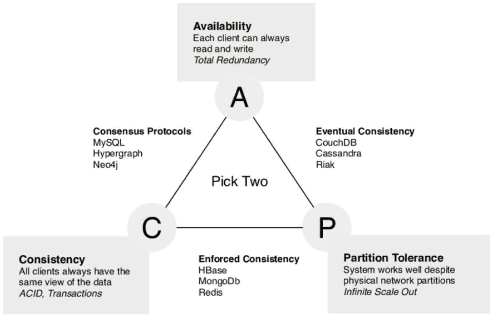

# Data integration

There is no universal database solution to address the variety of data requirements business application's needs. And it is not wishable to have such monster product. So the needs for data integration should come by considering the dataflows across a business process at stake or across an entire business organization and even sometime in a network of business partners (a blockchain network as an example). 

## Dataflows

At the application level, dataflow definition focuses to address where the data is created, where it is persisted, and how other components access the data. With microservice adoption, the root entity or aggregate will be managed by one service, and persisted in its boundary. There will be multiple databases, or multiple schemas within database cluster, and there will be different database type: document, relational, graph, object, files...  User interface external to this microservice will get the forms, for user will use to enter data. B2B integration can also receive data. User interface or B2B integration needs to use APIs at the microservice level to push those data. Event driven microservice will produce and consume events with ummutable data. 
At the higher level, a domain level, independent applications will communicate by exchanging data via service operations, via point to point messaging, via pub/sub mechanism, or by getting data using batch jobs and files.    
All those things are part of the dataflows. 

As another example when implementing microservices using the [CQRS]() pattern, we need to pay attention on what the write model is, and what are the read representation needs to be, and built from which sources. For each expected query, developer needs to define the formats, the local persistence mechanism, and how it will get data from other microservices. The good news is that, as query part are autonomous deployed microservice or even function as a service, they can be build independant to the bigger microservice responsible of the write operation. 

As part of this clear separation of read, write models, and aggregate per microservice, we also need to think about data consistency.

The classical approach to keep different systems data consistent, is to use two phase commit transaction, and the orchestrator to keep the write operation in expected sequence. In the world of microservice with REST end points, it is not possible to do two phase commit transaction across multiple microservices (see next section on the CAP theorem). Alternate model is to use event sourcing to keep write order in a log, and adopt eventual consistency, where we accept a small lag time in the data view.

## CAP Theorem

Data replication in distributed computing, like the cloud, falls into the problem of the [CAP theorem](https://en.wikipedia.org/wiki/CAP_theorem) where only two of three properties consisting of Consistency, Availability and Partition Tolerance can be met simultaneously. In most microservice implementation context, Consistency (see the same data at any given point in time) and Availability (reads and writes will always succeed, may be not on the most recent data) are in trade off. 

The diagram below explains the mapping of data persistence product types with the CAP theorem dimensions.

## Transaction

We do not want to write another book on transaction, but this is important to keep the following in mind when addressing application design and architecture:

* With ACID transaction, atomicity, isolation and durability are database characteristics. Consistency is application specifics and depends on what the code set in the transaction.
* ACID transaction is not about concurency (like it is in multithreading) but it is the ability to abort a transaction on error and have all writes from that transaction discarded.
* ACID consistency is aimed to keep business logic invariants on the data. Database can guaranty foreign key and constraints, but not business logic invariants.
* ACID isolation guarantees concurrently executing transactions are isolated from each other. They are executed in sequence. This approach impacts performance. So modern databases are using weaker algorithm for isolation to address a good level of scalability.
* ACID durability is to keep the data forever, so for single node, it is to write to harddisc, while with distributed database, a database must wait until all writes or replications are complete before claiming a transaction is successful. 

