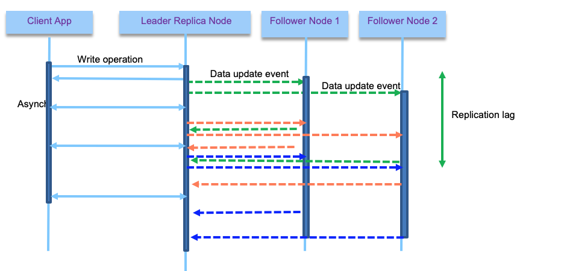
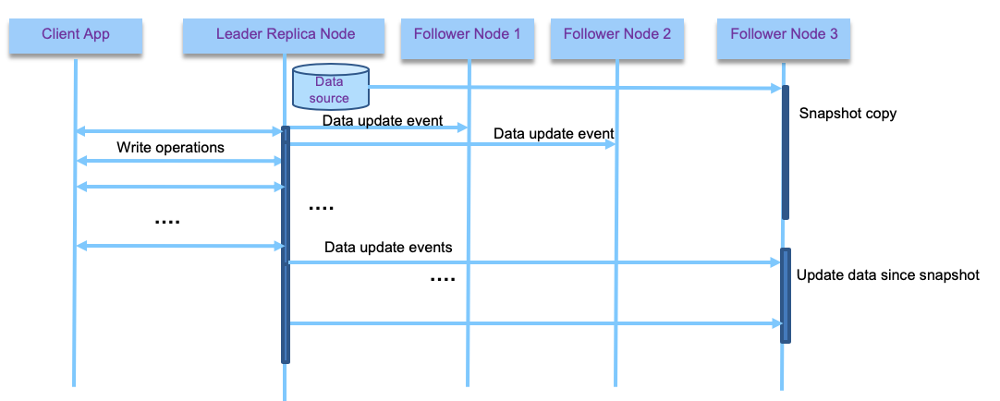
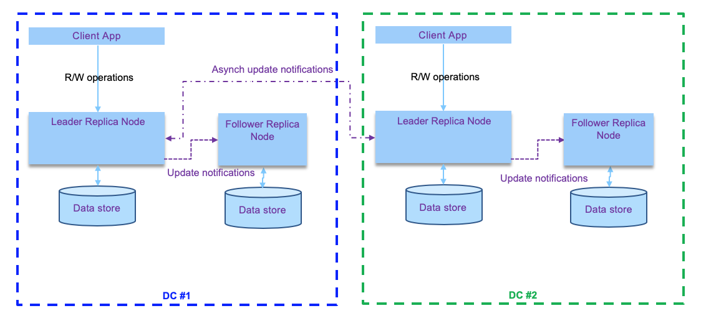

# Designing Data intensive applications

In this article we are highlighting some practice to design data intensive application and microservice solution. This is strongly linked to the adoption of event-driven microservices, but address the data consistency and eventual data consitency discussions, as well as the different strategies for implementation.

Started 10/30/2019, still under heavy work.

## Context

A typical modern business solution will include a set of microservices working together in choreography to exchange data. The adoption of event-driven microservice with all related design pattern is described in separate articles that you can read [here](https://ibm-cloud-architecture.github.io/refarch-eda/design-patterns/ED-patterns/). 

When zooming to a particular data intensive microservice we will find a set of important data centric features that may look like in the diagram below:

The components involved include:

* Databases to store data for long term
* Caches to speed up retrieving data from expensive operation
* Search indexes to support search on a corpus
* Stream processing to pub/sub messages with other processes, which are now also considered as long duration datastores (Kafka).
* Batch processing to move large data between data sources

When designing such application we need to address a set of important subjects:

* How to ensure data correctness and completeness?
* How to address good performance when exposing data, even when app is running slowly?
* How to scale and address increase in transaction volume and data size increase?
* What data to expose to other services via messaging ?
* What data to expose to other services via APIs ?
* How to support application reliability when some components are not performing within their SLA? How to be fault-tolerant?
* How to test fault-tolerance?
* How adding horizontal compute power impact the data access?

In modern big data applications, hardware redundancy is not suffisant, the design needs to support unexpected faults, to avoid cascading failures and to support new version deployment with rolling-upgrade capability. 

When addressing scalability and load growth, we need to define the load parameters: number of transaction per second, or number of read and write operation, number of active sessions, ... On average and at peak. Each microservice in a solution will have its own load parameters. 

From there we need to design to address the following issue:

* How does load growth impact performance while keeping existing compute resources?
* What is the increase of compute resource needed to support same performance while load growth?

The solution problem is a combination of different characteristics to address: read volume, write volume, data store volume, data complexity, response time, access logic...

For batch processing the measurment is the throughput: number of records per second or time to process n records. For real time processing the response time measures the time to get a response from a client's point of view after sending a request.

When defining service level agreement, it is important to use the median response time and a percentile of outliers. An example the median could be at 300ms at P99 (99/100) under 1s.

Tail latencies, or high percentils of response time, impacts directly user experience and cost money.

## Distributed data

Adopting microservice architecture, means distributed systems and distributed data. The main motivations for that are scalability (data operations load could not be supported by one server), high availability (by sharing the same processing between multiple machines), and reducing latency to distribute data close to the end users.

Vertical scaling is still bounded by hardware resources, so at higher load we need to support horizontal scaling by adding more machine in cluster or in multiple clusters.  When adding machines, we may want to adopt different techniques for data sharing: 

* shared memory
* shared storage
* shared nothing: cpu, memory and disk are per node. Cluster manages node orchestration over network. This architecture brings new challenges. 

### Replication

A first technique to  share data is to replicate or copy data between nodes. It fits well, when dataset is small enough to be persisted in one machine, and when data do not change a lot over time. Replication implementations are most of the time, black box for business application developers, but for clarity we can mention three types:

* **single-leader**: one of the replica is the leader, and receive write operations from client services. Other replicas are followers, listening to data updates from a replication log and modify their own data store. Read operations can happen on any node, and followers are specifically read-only. This is a pattern used by Kafka, Postgresql, RabbitMQ...

    

* **multi-leader**: multiple nodes accept write operations (they are leaders), and act as follower for other leaders. 
* **leaderless**: each node accept write operations. Client sends write to multiple replicas, accept p acknowledge (p <= number of nodes), but also performs n reads to assess eventual stale data. (This type is used in Cassandra or DynamoDB)

#### Single leader

Replication can be done synchronously or asynchronously. With synchronous the leader waits until at least one follower has comfirmed replication before reporting to the client that the write operation is successful. From the client point of view, it is a synchronous call.

With asynchronous the leader does not wait for followers to replicate. With synchronous, we are sure the data are not lost as at least one follower responded, but if the follower node has failure then the write operation is not consider completed, even if leader has the data. The client can do a retry. But the leader may need to block other write requests until it sees a follower alive. With synch, the data is also consistent with the leader. The figure above illustrates a synchronous mechanism for client - leader and first follower to respond, and asynchronous for the other followers.

It is important to note that asynch replica may be the only possible solution when the number of followers is important or when they are separated by long distance with high latency networking communication.  Because a full synchronous mechanism will block the write operations in case of a follower failure and will not be reliable.

With asynch, two reads at the same time on the leader and one of the follower will not get the same results. This inconsistency is temporal: when there is no more write then the followers will become eventually consistent. This elapse time is called replication lag.

This lag can have some interesting derived issues, like seeing data in one query (done on a follower with small lag) and then not seeing the data from the same query done on a bigger lagged follower. To avoid that the pratice is to use a monolitic read: user makes several reads in sequence, they will not see time go backward. Which can be achieved by ensuring the reads for a given user are done on the same follower. This is what kafka does by assigning a consumer to partition.

With asynch replica, if the leader fails, data not yet replicated are lost until a new leader starts to accept new writes. 

Also adding a new follower brings other challenges: as the data are continuously being written to the leader database, copying the database files to the new follower will not be consistent. One adopted solution is to snapshot the database, without locking write operations, and copy the data to the follower, then from this snapshot, consumes the update log. To work the snapshot position needs to be known in the replication log. 

To support follower failure, the log needs to keep position of the last commited read, so when the follower restarts, it can load data from this position in the log. 

When the leader fails, a follower needs to take the leadership, and then other followers need to get data from the new leader. Kafka, combined with zookeeper, uses those last two mechanisms to support replication. Selecting the new leader is based on consensus algorithm, to ensure minimum data lost.  

When using single leader, it is possible to reach a split brain state, when the old leader comes back to live, and thinks it is still a leader: both leaders accept writes which leads to data corruption. 

#### Multi leader

With multi leader configuration each leader gets write operations, and propagate data update notifications to all nodes. This is an active-active replication. And it is the practice when dealing with multiple datacenters. 

The write operations are propagated asynchronously which is more permissive to network failure. It is important to note that the following problems need to be addressed with this topology:

* Update of the same data at the same time, leading to write conflict
* Automatic primary key generation by the database may create duplicate keys
* Triggers that work on conditions on the data to do something could never be triggered due to data conditions that will never happen in this active - active configuration.
* Integrity constraints can be violated, as one records may be processed without the others being yet present.

For the write conflict resolution, there are different strategies, one uses timestamps so the last write wins the record update, but this cloud lead to data lost. In fact conflict resolution will be dependant of the business logic and data knowledge. So custom code needs to be done to apply this logic to write conflicts.

When there is more than two leaders, the replicas topology can be done in ring, start or all-to-all:

With Ring, a leader forward and propagate its own write to one neighbor. With star one designated root node forwards writes to all of the other nodes. Finally with all-to-all, every leader sends its writes to every other leader.

With Ring and Start, a node failure impacts the data replication to any node, and with all to all we need to address looping on the same write. The mitigation is to use a unique identifier for each node, so a write event coming with the same node_id of the current node id is discarded.

## Compendium

* [Designing data intensive application - Martin Kleppmann](https://www.amazon.com/Designing-Data-Intensive-Applications-Reliable-Maintainable/dp/1449373321/ref=sr_1_3?crid=F3G6F7KYQZMH&keywords=designing+data+intensive+applications&qid=1572566804&sprefix=designing+data+%2Caps%2C204&sr=8-3)