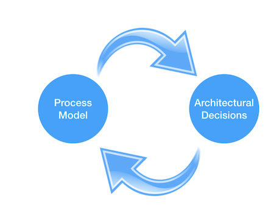
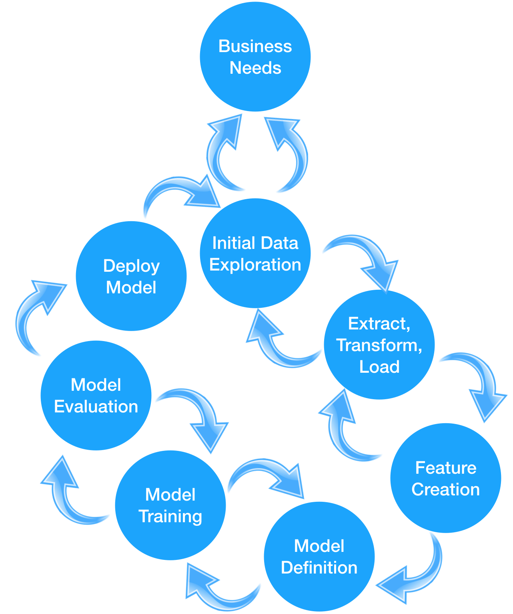

# The Lightweight IBM Cloud Garage Method for Data Science

*A lightning fast architecture development method and data science development process model*

The Lightweight IBM Cloud Garage Method for Data Science is composed of a process model to develop individual technology components based on a reference architecture and a architecture development framework for extending the Solution Architecture beyond the reference architecture. This method on purpose does not include any requirement engineering or design thinking tasks since they are covered in the IBM Cloud Garage Method. If at a later point in time we think we need to adopt Design Thinking to the Domain of Data Science we will do it. Because it can be hard to initially define the architecture of a project, this method starts with the reference architecture and supports architectural changes while following the process model. This way application development and architectural development work hand in hand to produce a production ready and deployable product at the end of each iteration. The reference architecture document describes the suggested architecture in great detail and separate companion document discusses the [architectural decision guidelines](https://developer.ibm.com/articles/data-science-architectural-decisions-guidelines/) used for changing the reference architecture. This document also contains the Architecture Principles which have been used to develop the reference architecture and which might be adjusted to the target enterprise architecture principles of individual project settings.




## The Lightweight IBM Cloud Garage Method for Data Science Process Model

This section introduces this lightweight process model.



The first thing that you should notice is the bidirectional communication between "Business Needs" and "Initial Data Exploration". This is a data driven method and data is crucial on what can be achieved, therefore "Business Needs" may be adjusted based on the possibilities provided by give data. Second, with this model, there is no communication between "Business Needs" and other steps because an iteration of this process is very short (in the range of hours and days).

The following sections explain the individual tasks.

### Initial Data Exploration

This task is crucial for understanding your data. Data quality is the most important driver for success in any data science project. So, this task lets you address data quality from the beginning. This includes going back to the data owners and asking them for better quality data, if applicable.

#### Technology Component
Suggested technology components to perform this task:

* Jupyter Lab
* Python
* Seaborn

### Extract, transform, load (ETL)

This task is an important step in transforming the data from the source system into data suitable for analytics. In traditional data warehousing, this process includes accessing the online transaction processing (OLTP) system’s databases, transforming the data from a highly normalized data model into a Star or Snowflake Schema, and storing the data to a data warehouse. In data science projects, this step is usually much simpler. The data arrives in an exported format (for example, JSON or CSV). But, sometimes de-normalization must be done as well. The result usually ends up in a bulk storage like Cloud Object Store.

#### Technology Component

Suggested technology components to perform this task:

* Apache SparkSQL
* COS (Cloud Object Store)

### Feature creation

This task transforms input columns of various relations into additional columns to improve model performance. A subset of those features can be created in an initial task (for example, one-hot encoding of categorical variables or normalization of numerical variables). Some others require business understanding or multiple iterations to be considered. This task is one of those benefiting the most from the highly iterative nature of this method.

#### Technology Component

Suggested technology components to perform this task:

* scikit-learn, pandas
* Apache Spark

### Model definition

This task defines the machine learning or deep learning model. Because this is a highly iterative method, various iterations within this task or including up- and downstream tasks are possible. I recommend starting with simple models first for baseline creation after those models are evaluated.

#### Technology Component


Suggested technology components to perform this task:

* scikit-learn
* Apache SparkML
* TensorFlow

### Model Training

This task trains the model. The task is set apart from model definition and evaluation for various reasons. First, training is a computationally intense task that might be scaled on computer clusters or GPUs. Therefore, an architectural cut is sometimes unavoidable. (For example, model definition happens in Keras, but training happens on a Keras model export using Apache SystemML on top of Apache Spark running on a GPU cluster.) In hyperparameter tuning and hyperparameter space exploration, the downstream task “Model Evaluation” can be part of this asset.

#### Technology Component


Suggested technology components to perform this task:

* scikit-learn
* Apache SparkML
* TensorFlow

### Model evaluation

This task evaluates the model’s performance. Given the nature of the task, different metrics must be applied, for example, categorical-cross entropy for a multi-class classification problem. It’s important to divide the data set into training, test, and validation (if cross-validation isn’t used) and keep track of the performance of different feature engineering, model definition, and training parameters. In addition to model performance, Trusted AI (Adversarial Robustness, Model Bias)parameter need to be evaluated as well.

#### Technology Component


Suggested technology components to perform this task:

* scikit-learn
* Apache SparkML
* TensorFlow
* AI Fairness 360
* Adversarial Robustness Toolbox

### Model deployment

This task deploys the model. The task depends heavily on the use case, especially, on the stakeholder’s expectation on consuming the data product. So, valid ways of deployment include:

* An interactive Jupyter Notebook
* An export of an already run, static Jupyter Notebook resembling into a report
* A REST endpoint allowing scoring (and training) of the model (for example, backed by a docker container running on Kubernetes)
* A full-fledged web or mobile application

#### Technology Component

Suggested technology components to perform this task:

* Jupyter
* Seldon


### Project Asset Naming Convention

Need a structure to name your assets? Here’s our recommended convention. Note that we recommend to always use project_name, while the others are optional.

```
[project_name].data_exp.<technology>.<version>.<extension>
[project_name].etl.<technology>.<version>.<extension>
[project_name].feature_eng.<technology>.<version>.<extension>
[project_name].model_def.<technology>.<version>.<extension>
[project_name].model_train.<technology>.<version>.<extension>
[project_name].model_evaluate.<technology>.<version>.<extension>
[project_name].model_deployment.<technology>.<version>.<extension>
```


