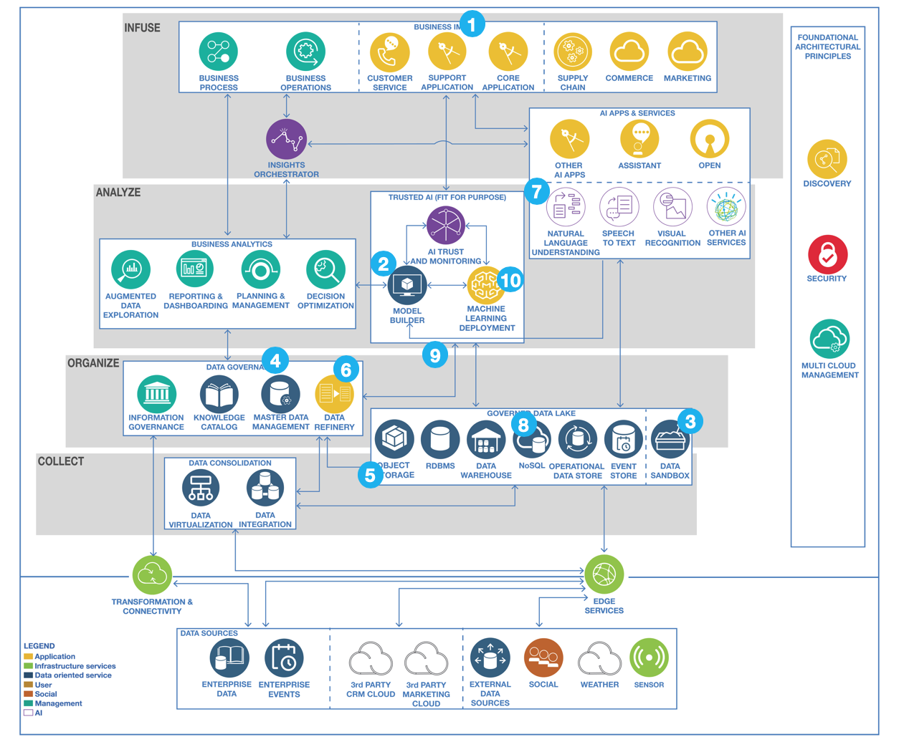

# Building a machine learning model

## Integrate ML workbench with data 

Reusing our reference architecture, we are now defining the flow of activities happening to develop the model and to continuously improve it overtime while the intelligent application is running in production:

1. The business has identified a desired outcome that can be realized by a building a predictive model e.g. e.g. customer churn and next best action.
1. To build the predictive model; the Business Analyst, Data Steward, Data Scientist and Cognitive Architect collaborate using Watson Studio.
1. They look at existing catalogs and data collections (such as in an enterprise data lake or data warehouse) to identify the optimal informing features towards building an effective predictive model. Understanding the needs and goals of the new models will provide the metrics required to determine if existing data structures may be used, or if new environments will need to be created. At this time, the overall design goals will be defined i.e. should it be a data lake or warehouse, time sensitivity of the data, where should it be deployed etc.
1. They discuss some signals could be extracted out of third party and social data that is available on a different cloud. In today’s hybrid world, this information may be pulled in via tools like ICP for Data and choice can be made around what use as is, what to virtualize and what to federate.
1. Using a cloud native data service, these additional signals are pulled into the data collections.  Depending on the choices made at step 3, tools are available to include the new data sources in the environment.
1. Various portions of the informing data collections are refined to engineer features suitable for the predictive model using Data Refinery. Often data requires some curation, or possibly new data is created (i.e. aggregate totals may be created) or some other modification/enhancement will be needed.
1. Since some of the information is unstructured, a number of Watson NLU APIs are used to extract entities and taxonomies to enrich the unstructured information with relevant meta-data to extract entities and taxonomies to enrich the unstructured information with relevant meta-data.  With data like this, we can choose the optimal database technology to store and to access the data.
1. As these enrichments are deemed to be impacting many business use cases, these are methodically introduced as part of the ongoing data enrichment.  Given the iterative nature of building models, it’s important to note that a key feature is the ability to react to change quickly.  
1. With multiple batch experiments and tuned hyperparameters, a performant model is available for use.  If the user has chosen an on-premise deployment, they may choose to take advantage of the fact that our appliance has the Watson Studio built directly onto the warehousing system.
1. The model is deployed using Watson Machine Learning, providing a scalable model with continuous learning.

## Real time data sources

The following diagram presents another view for data injection and transformation from real time events streams persisted to data repositories or warehouse. When using event backbone combined with event store, data persisted in this area can be combined with warehouse data, as data sources for the Data Scientist to build his model.

* The data transformation can be controled by a workflow engine, using timer to trigger operations during down time. 
* The data repositories represent a data lake to be used as source for defining training and test sets for the machine learning.
* The model building integrates with a ML cluster to run the different algorithm for selecting the best model.