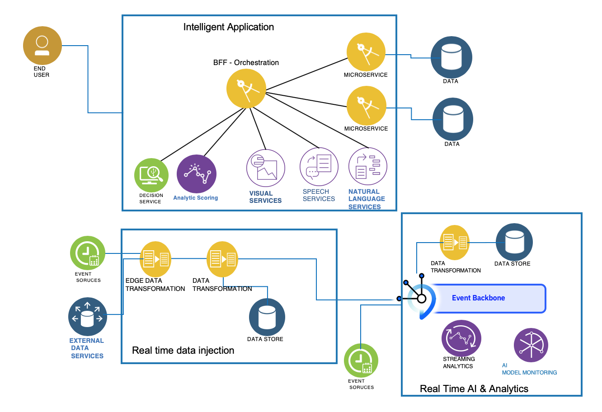

# Runtime architectures

## Intelligent application and real time analytics

The following diagram illustrates the high-level view of a typical intellingent applicatin involving real time analytics like a predictive scoring service, and event stream analytics.

The components involved in this diagram represents a typical cloud native application using different microservices and scoring function built around a model created by one or more Data Scientist using machine learning techniques. We address how to support the model creation in the next section. The top of a diagram defines the components of an intelligent web application:

* End user is an internal or external business user. It uses a single page application, or mobile application connected to a back-end to front end service.
* The back-end to front end service delivers data model for the user interface and perform service orchestration.
* As a cloud native app, and applying clear separation of concerns, we have different microservices, each being responsibles to have its own data source.  
* A scoring service, most likely a function as service, runs the model.
* The action to perform once the scoring is returned, is business rules intensif, so as best practice, we propose to externalize the rule execution within a decision service.

The lower part of the diagram illustrates real time analytics on event streams, and continuous data injection from event sources:

* The event sources could be IoT devices, or Edge computing in mist.
* A first level of data transformation can be performed at the edge level in the mist. This is an optional level. 
* A second level of data transformation, run in the fog, and publish events to an event backbone while also persisting data to a data repository for future analytics work.
* The event backbone is used for microservice to microservice communication, as a event sourcing capability, and support pub/sub protocol.
* One potential consumer of those events could be a streaming analytics apply a machine learning model on the event data. The action part of this streaming analytics component is to publish enriched events. Aggregates, count, any analytics computations can be done in real time. 
* The AI Analytics layer needs to include a component to assess the performance of the model, and for example ensure there is not strong devision on the accuracy or responses are not bias. 
* Finally, as we address data injection, there are patterns where the data transformation is done post event backbone to persist data in yet another format.

## Modeling architecture

In the following diagram we are how to gather the data for exposing to the Data Scientist all the needed data from the different data sources: being public data, enterprise - private, or coming from event backbone. 

* The data transformation can be controled by a workflow engine, using timer to trigger operations during down time. 
* The data repositories represent a data lake to be used as source for defining training and test sets for the machine learning.
* The model building integrates with a ML cluster to run the different algorithm for selecting the best model.
